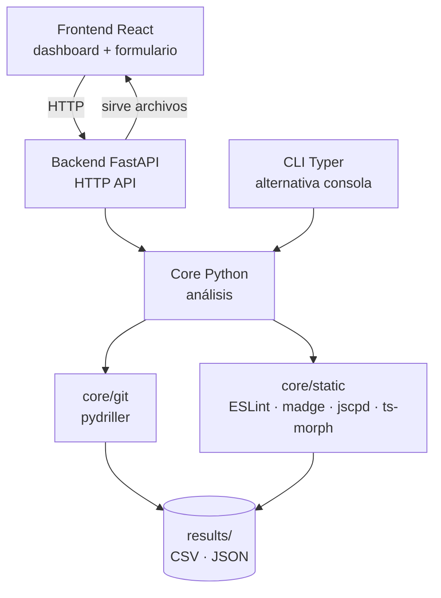
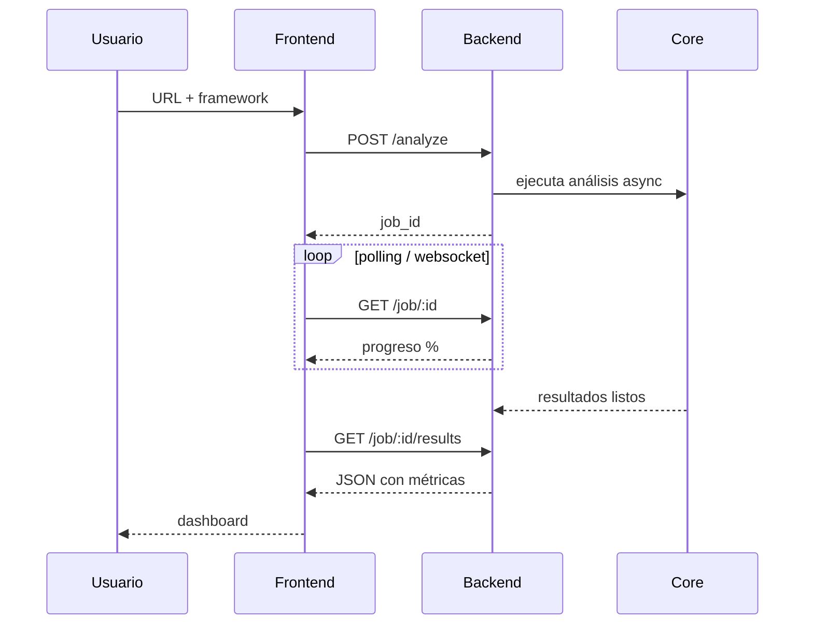

# Arquitectura — repomine

## Diagrama de componentes

---

## Stack tecnológico

| Capa | Tecnología | Justificación |
|---|---|---|
| Análisis (core) | Python 3.13 + pydriller | Base de código existente, pydriller es estándar en MSR |
| Análisis estático JS/TS | ESLint, madge, jscpd, ts-morph | Herramientas nativas del ecosistema JS/TS |
| Gestión de dependencias Python | uv | Reemplaza pip + venv, más rápido y moderno |
| API | FastAPI + uvicorn | Async, liviano, tipado con Pydantic |
| Frontend | React | Stack principal, más visible en portafolios públicos |
| Documentación | MkDocs Material | Renderiza desde markdown, integra con CI/CD |

---

## Flujo de un análisis

---

## Decisiones de diseño

**Core separado del backend**
El `core/` contiene lógica pura de análisis sin dependencias HTTP. Esto permite que el CLI lo use directamente sin levantar el servidor.

**Jobs asincrónicos**
El análisis puede tardar varios minutos en repos grandes. El backend encola el trabajo y expone un endpoint de estado para que el frontend muestre progreso.

**Análisis por tecnología**
El sistema activa analizadores específicos según la tecnología declarada (NestJS, Angular, React). Para tecnologías no soportadas en profundidad (Python, Laravel, Flutter) se ejecuta análisis genérico: métricas git + líneas de código + duplicación.

---

## Fases de desarrollo

| Fase | Contenido |
|---|---|
| 1 | `core/git/` — extracción de commits, hotspots, autores con pydriller |
| 2 | `core/static/` — análisis estático JS/TS (complejidad, dependencias, duplicación) |
| 3 | `backend/` — FastAPI con jobs asincrónicos |
| 4 | `frontend/` — dashboard React |
| 5 | `cli.py` — CLI con Typer |
| 6 | GitHub/GitLab API — issues, PRs, tiempos de ciclo |
| 7 | Documentación con MkDocs Material |

---

## Roadmap de funcionalidades

### MVP — Dashboard de Salud del Repositorio
Funciona solo con historial git, sin API externa.

- Extracción de commits: mensaje, id, autor, co-authors, fecha
- Hora más activa de desarrollo
- Hotspots: archivos con más modificaciones y mayor tendencia a bugs
- Bus Factor: cuántos desarrolladores concentran el conocimiento de cada módulo
- Clasificación de commits con NLP (aditivo, correctivo, perfectivo — taxonomía de Swanson)
- Detección de acoplamiento entre archivos

### Fase 2 — Análisis Estático Profundo
- Complejidad ciclomática por función/archivo
- Dependencias circulares entre módulos
- Duplicación de código
- Analizadores específicos por framework: NestJS, Angular, React

### Fase 3 — Integración con GitHub/GitLab API
Requiere token del usuario.

- Lead Time y Cycle Time de PRs
- Análisis de sentimiento en comentarios de PRs
- Recomendador de revisores basado en historial de modificaciones
- Métricas de flujo del equipo

### Ideas experimentales (sin fecha)
- Predicción de bugs con ML (modelo entrenado sobre historial de commits)
- Resumen automático del estado del repositorio con LLM
