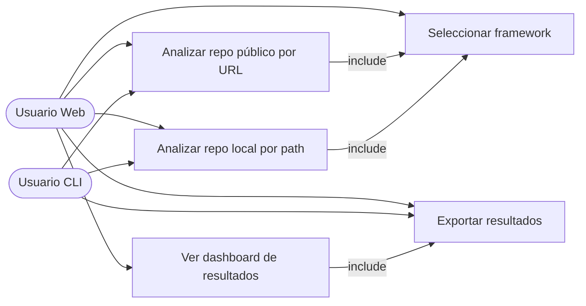

# Casos de Uso — repomine

## Diagrama general

---

## UC-01: Analizar repositorio público por URL

| Campo | Detalle |
|---|---|
| **Actor** | Usuario Web / Usuario CLI |
| **Precondición** | El repositorio es público y accesible |
| **Flujo principal** | 1. Usuario ingresa URL del repositorio   2. Selecciona framework (UC-05)   3. El sistema clona el repositorio temporalmente   4. Se ejecutan los analizadores correspondientes al framework   5. El sistema muestra el progreso en tiempo real   6. Se presentan los resultados en el dashboard |
| **Flujo alternativo** | Si la URL no es válida o el repo no es público → se muestra error descriptivo |
| **Postcondición** | Resultados disponibles para visualización y descarga |

---

## UC-02: Analizar repositorio local por path

| Campo | Detalle |
|---|---|
| **Actor** | Usuario Web / Usuario CLI |
| **Precondición** | El path proporcionado existe y es un repositorio git válido |
| **Flujo principal** | 1. Usuario ingresa el path local del repositorio   2. Selecciona framework (UC-05)   3. El sistema lee el repositorio directamente   4. Se ejecutan los analizadores correspondientes al framework   5. Se presentan los resultados |
| **Flujo alternativo** | Si el path no existe o no es un repo git → error descriptivo |
| **Postcondición** | Resultados disponibles para visualización y descarga |

---

## UC-03: Ver dashboard de resultados

| Campo | Detalle |
|---|---|
| **Actor** | Usuario Web |
| **Precondición** | Un análisis fue completado exitosamente |
| **Flujo principal** | 1. El sistema muestra el dashboard con secciones: Overview, Hotspots, Code Quality, Commit Activity, Dependencies, Bug Prediction   2. Usuario navega entre secciones   3. Cada sección muestra métricas y visualizaciones |
| **Flujo alternativo** | Si el análisis falló parcialmente → se muestran las secciones disponibles con advertencia |
| **Postcondición** | Usuario puede exportar los datos de cada sección |

---

## UC-04: Exportar resultados

| Campo | Detalle |
|---|---|
| **Actor** | Usuario Web / Usuario CLI |
| **Precondición** | Un análisis fue completado |
| **Flujo principal** | 1. Usuario selecciona sección a exportar (o todo)   2. Selecciona formato (CSV o JSON)   3. El sistema genera el archivo   4. Se descarga automáticamente |
| **Postcondición** | Archivo descargado en la máquina del usuario |

---

## UC-05: Seleccionar framework

| Campo | Detalle |
|---|---|
| **Actor** | Usuario Web / Usuario CLI |
| **Precondición** | Se está iniciando un análisis (UC-01 o UC-02) |
| **Flujo principal** | 1. Usuario selecciona el framework principal del repositorio: NestJS, Angular, React, JS/TS genérico   2. El sistema detecta el lenguaje automáticamente a partir de las extensiones de archivos   3. Se activan los analizadores específicos del framework seleccionado |
| **Flujo alternativo** | Si no se especifica framework → se ejecuta análisis genérico (git + métricas básicas) |
